# Лабораторная работа №2
## Продвинутые методы безусловной оптимизации

**Команда:** Егор Гуров, Александр Громоздин, Николай Гавришок

**Вариант:** пакет оракулов и датасетов №2: Logistic Regression + $L_2$ для классификации, Poisson Regression + $L_2$ для регрессии.  
**Невыпуклая 2D-функция:** функция Била.  
**Исследовательский трек:** трек 4 — «Осторожный» L-BFGS и отказ от Вульфа.

---

## Распределение ролей

- **Егор Гуров:** аналитический вывод формул для Logistic/Poisson-оракулов и `hess_vec`; математическая часть отчёта; описание и анализ экспериментов 2.2–2.3; участие в анализе исследовательского трека.
- **Александр Громоздин:** реализация `LineSearchTool`, `linear_conjugate_gradients`, `nonlinear_conjugate_gradients`, `hessian_free_newton`; интеграция ноутбука; эксперименты 2.4–2.5; анализ поведения методов на `phishing` и `real-sim`.
- **Николай Гавришок:** реализация `hess_vec`, `hess_vec_finite_diff`, `lbfgs`, `cautious_lbfgs`; эксперимент 2.6; исследовательский трек 4; графики и оформление отчёта.

---

## 0. Описание данных и общих настроек

В экспериментах использовались датасеты из пакета варианта №2.

| Датасет | Задача | Оракул | Размерность |
| :--- | :--- | :--- | :--- |
| `phishing` | классификация | Logistic Regression + $L_2$ | $m = 11055,\ n = 68$ |
| `cadata` | регрессия | Poisson Regression + $L_2$ | $m = 20640,\ n = 8$ |
| `real-sim` | классификация | Logistic Regression + $L_2$ | $m = 72309,\ n = 20958$ |

В основных ML-экспериментах использовались стандартные настройки:
- начальная точка: $x_0 = 0$;
- регуляризация: $\lambda = 1/m$;
- критерий остановки: $\|\nabla f(x_k)\| \le 10^{-6}\|\nabla f(x_0)\|$;
- для L-BFGS в базовом сравнении: размер истории $L=10$;
- для HFN: внутренняя система решается методом сопряжённых градиентов через `hess_vec`.

---

## 1. Проверка корректности `hess_vec`

### Постановка

Для ML-оракулов требуется реализовать произведение гессиана на вектор без явного построения гессиана. Проверка выполнялась сравнением аналитического значения
$$
\nabla^2 f(x)v
$$
с разностной аппроксимацией `hess_vec_finite_diff`.

Проверка выполнялась для обоих ML-оракулов:
- `LogisticL2Oracle`;
- `PoissonL2Oracle`;

а также для двух типов матриц:
- плотная матрица `numpy.ndarray`;
- разреженная матрица `scipy.sparse.csr_matrix`.

В обновлённом ноутбуке проверка проводится на нескольких случайных точках и векторах, после чего выводится таблица максимальной и средней относительной ошибки.

### Выводы

Полученные ошибки находятся на уровне, ожидаемом для конечных разностей. Это подтверждает, что:
- формулы для `hess_vec` реализованы корректно;
- реализация работает как для плотных, так и для разреженных матриц;
- HFN может использовать `hess_vec` без явного построения полной матрицы Гессе.

---

## 2. Эксперимент 2.2. Линейный CG против GD на квадратичных задачах

### Постановка

Сравнивались градиентный спуск и линейный метод сопряжённых градиентов на квадратичной задаче
$$
f(x)=\frac12 x^T A x - b^T x.
$$

Варьировались:
- размерность: $n \in \{10, 100, 300\}$;
- число обусловленности: $\kappa \in \{1, 10, 10^2, 10^3, 10^4\}$.

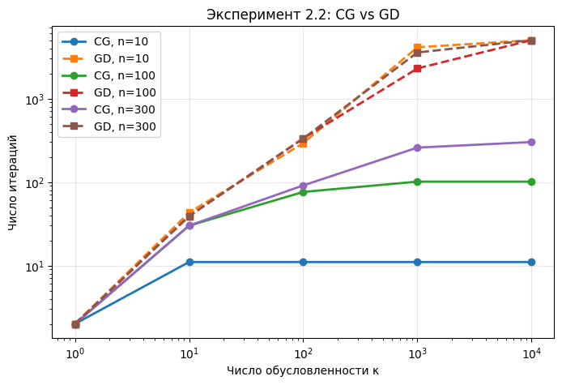

### Выводы

Градиентный спуск сильно зависит от числа обусловленности. При больших $\kappa$ он начинает двигаться зигзагообразно вдоль вытянутых оврагов функции и требует большого числа итераций.

Метод сопряжённых градиентов ведёт себя значительно лучше. В точной арифметике для квадратичной функции он сходится не более чем за $n$ итераций, а на практике сохраняет это преимущество с учётом численных ошибок. Поэтому при плохой обусловленности CG выигрывает у GD на порядки.

---

## 3. Эксперимент 2.3. Влияние размера истории $L$ в L-BFGS

### Постановка

Исследовался метод L-BFGS при разных размерах истории:
$$
L \in \{0, 1, 5, 10, 20, 50, 100\}.
$$

Случай $L=0$ трактуется как градиентный спуск с линейным поиском Вульфа. Для каждого значения $L$ строились графики:
- относительный квадрат нормы градиента от номера итерации;
- относительный квадрат нормы градиента от реального времени;
- итоговое время работы от $L$.

Также отдельно исследовалась плохо обусловленная квадратичная функция с $\kappa=1000$.

### Logistic Regression, датасет `phishing`

| По итерациям | По времени | Итоговое время |
| :---: | :---: | :---: |
| 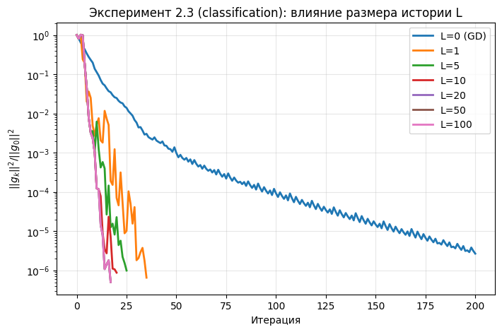 | 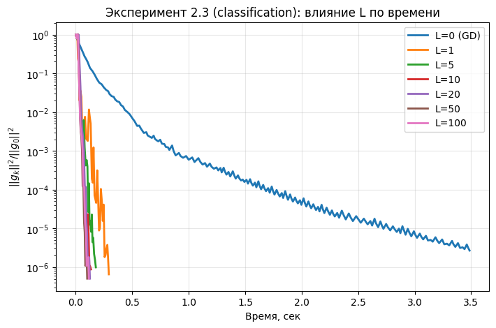 | 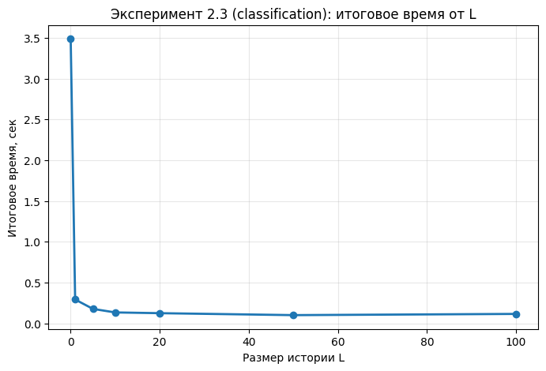 |

### Poisson Regression, датасет `cadata`

| По итерациям | По времени | Итоговое время |
| :---: | :---: | :---: |
| 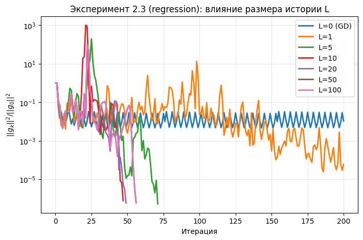 | 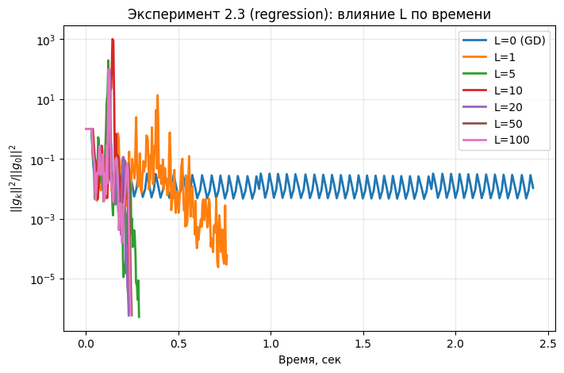 | 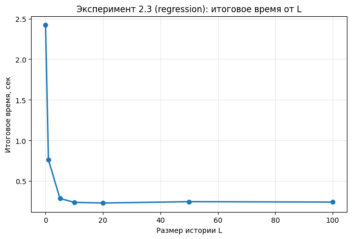 |

### Плохо обусловленная квадратичная функция

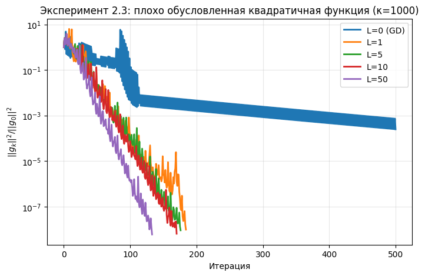

### Анализ памяти и сложности

L-BFGS хранит последние $L$ пар векторов $(s_i, y_i)$. Каждый вектор имеет размерность $n$, поэтому память составляет примерно
$$
2Ln
$$
вещественных чисел. Стоимость вычисления направления через двухцикловую рекурсию равна
$$
O(Ln).
$$

Увеличение $L$ может уменьшать число итераций, но каждая итерация становится дороже. Поэтому слишком большой размер истории не всегда ускоряет метод по реальному времени.

### Выводы

Для датасетов из варианта наблюдается «плато»: после $L \approx 5$–$10$ дальнейшее увеличение истории почти не ускоряет сходимость. Практически разумная зона — $L \in [5, 10]$.

При $L=1$ или $L=5$ метод уже заметно лучше обычного градиентного спуска. Это показывает, что даже небольшая память позволяет уловить важную информацию о кривизне функции.

На плохо обусловленной квадратичной задаче увеличение $L$ особенно полезно. Чем хуже обусловленность, тем более вытянуты линии уровня функции, и тем важнее хорошая аппроксимация обратного гессиана.

---

## 4. Эксперимент 2.4. Сравнение методов на реальных ML-задачах

### Постановка

На реальных ML-оракулах сравнивались:
- GD;
- нелинейный CG с формулой Полака–Рибьера;
- HFN;
- L-BFGS с $L=10$;
- полный метод Ньютона.

Для `real-sim` полный Ньютон не запускался, поскольку матрица Гессе имела бы размер примерно $20958 \times 20958$, что слишком дорого по памяти.

### Значение функции от номера итерации

| `phishing` | `cadata` | `real-sim` |
| :---: | :---: | :---: |
| 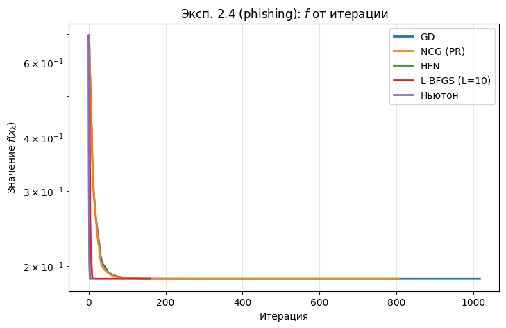 | 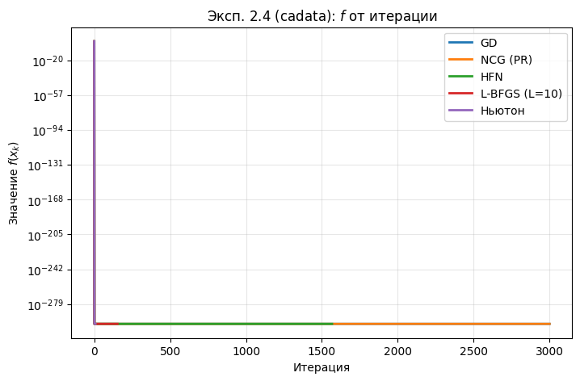 | 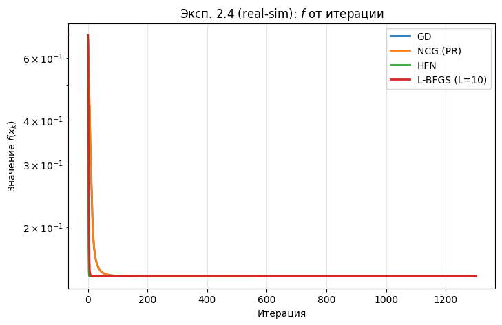 |

### Значение функции от времени

| `phishing` | `cadata` | `real-sim` |
| :---: | :---: | :---: |
| 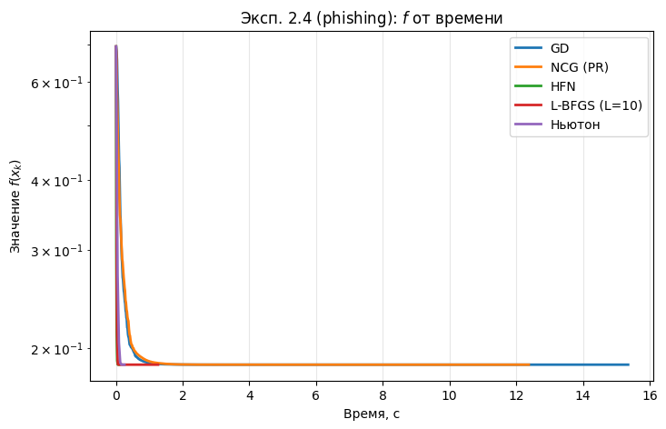 | 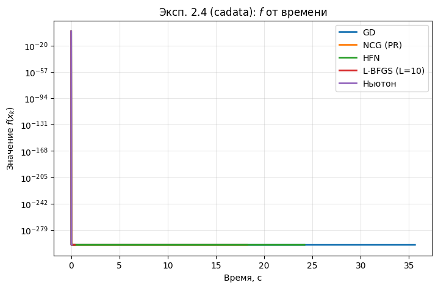 | 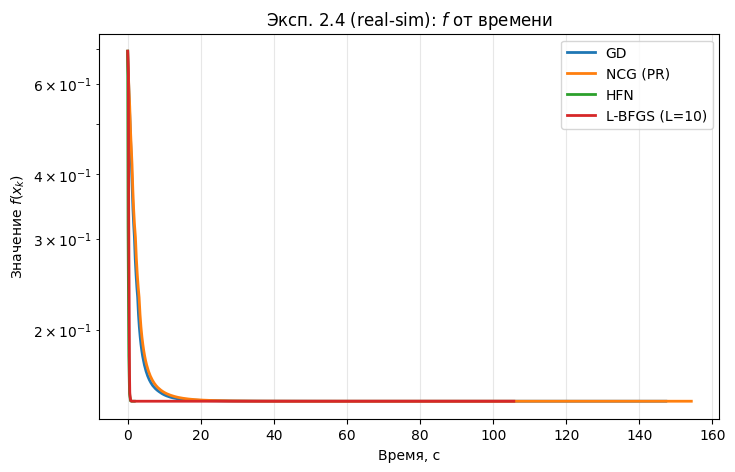 |

### Относительный квадрат нормы градиента от времени

| `phishing` | `cadata` | `real-sim` |
| :---: | :---: | :---: |
| 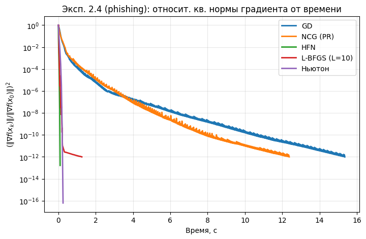 | 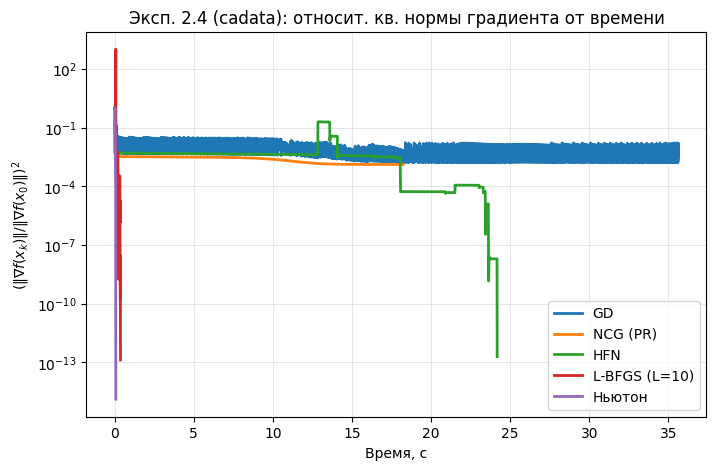 | 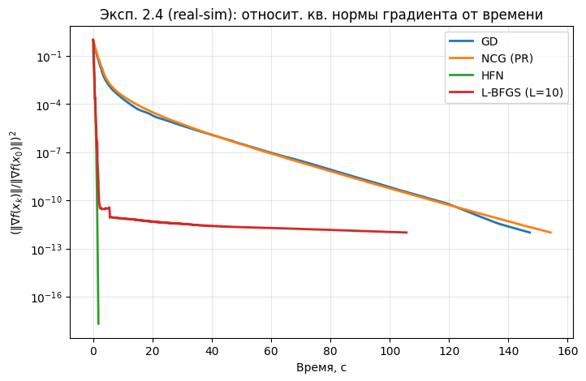 |

### Сводка по числу внешних итераций

| Датасет | GD | NCG | HFN | L-BFGS | Newton |
| :--- | ---: | ---: | ---: | ---: | ---: |
| `phishing` | 1017 | 807 | 6 | 159 | 6 |
| `cadata` | 3000 | 3000 | 1567 | 153 | 8 |
| `real-sim` | 573 | 573 | 7 | 1302 | не запускался |

### Выводы

HFN делает меньше всего внешних итераций: на `phishing` и `real-sim` ему достаточно нескольких шагов. Однако лидер по числу итераций не всегда обязан быть лидером по реальному времени, потому что одна итерация HFN включает внутренний CG и множество вызовов `hess_vec`.

На маленьком по числу признаков датасете `cadata` полный Ньютон очень эффективен: матрица Гессе мала, поэтому её можно явно построить и разложить. На широком датасете `real-sim` полный Ньютон не подходит по памяти, а HFN остаётся применимым, поскольку использует только произведения гессиана на вектор.

GD и NCG в целом уступают продвинутым методам. Особенно это заметно на `cadata`, где методы первого порядка достигают лимита итераций, тогда как L-BFGS и Newton сходятся существенно быстрее.

---

## 5. Эксперимент 2.5. Микропрофилирование

### Постановка

Для трёх продвинутых методов измерялась средняя доля времени за итерацию:
- оракул: вычисление функции, градиента, а для HFN ещё и `hess_vec`;
- линейная алгебра: внутренний CG, двухцикловая рекурсия L-BFGS и т.д.;
- линейный поиск.

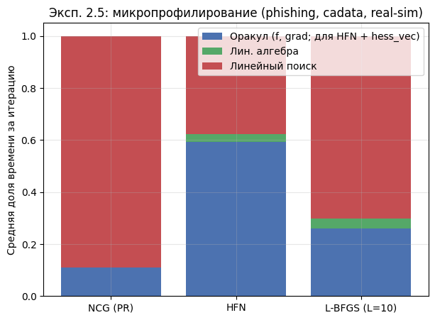

### Таблица долей времени

| Метод | Oracle | Linear algebra | Line search |
| :--- | ---: | ---: | ---: |
| NCG | 0.109 | 0.001 | 0.891 |
| HFN | 0.590 | 0.029 | 0.381 |
| L-BFGS | 0.263 | 0.040 | 0.698 |

### Выводы

У NCG и L-BFGS основную часть времени занимает линейный поиск. Это ожидаемо: сами векторные операции дешёвые, а условия Вульфа требуют нескольких вычислений функции и производной вдоль направления.

У HFN структура затрат другая. Большая доля времени уходит на оракул, потому что во внутреннем CG многократно вызывается `hess_vec`. Это объясняет, почему HFN может проигрывать L-BFGS по времени, даже если требует намного меньше внешних итераций.

---

## 6. Эксперимент 2.6. Оптимизационная точность против качества предсказания

### Постановка

Данные разделялись на train/test в пропорции 80/20. На обучающей выборке запускался L-BFGS, а на каждой итерации фиксировались:
- значение функции на train;
- относительный квадрат нормы градиента;
- качество на test.

Для классификации использовалась Accuracy, для регрессии — MSE. Также сравнивались разные значения регуляризации:
$$
\lambda \in \{0.1/m,\ 1/m,\ 10/m\}.
$$

| `phishing`, Accuracy | `cadata`, MSE |
| :---: | :---: |
|  |  |

### Качественная сводка по влиянию $\lambda$

| Регуляризация | Наблюдаемое поведение |
| :--- | :--- |
| $\lambda = 0.1/m$ | Слабая регуляризация: train loss продолжает уменьшаться, но test-метрика быстро выходит на плато; риск переобучения выше. |
| $\lambda = 1/m$ | Базовое значение: разумный баланс между оптимизацией train loss и качеством на test. |
| $\lambda = 10/m$ | Более сильная регуляризация: модель становится устойчивее, но может недообучаться; точка насыщения качества достигается быстрее. |

### Выводы

Тестовая метрика перестаёт существенно улучшаться намного раньше, чем оптимизационный критерий достигает высокой точности. На `phishing` Accuracy выходит на плато примерно в первые десятки итераций, после чего L-BFGS продолжает уменьшать train loss и норму градиента, но качество на test почти не меняется.

Это показывает, что в прикладных ML-задачах нет смысла всегда оптимизировать функцию до очень малой нормы градиента. Для практики полезнее использовать раннюю остановку по валидационному качеству или более мягкий порог оптимизационной точности, например $10^{-3}$–$10^{-4}$ по относительному критерию.

При уменьшении $\lambda$ разрыв между train и test становится заметнее: train loss продолжает падать, а test-качество не улучшается или ухудшается. При увеличении $\lambda$ модель становится более сглаженной, но чрезмерно большая регуляризация может привести к недообучению.

---

## 7. Исследовательский трек 4. Cautious L-BFGS и отказ от Вульфа

### Постановка

В классическом BFGS/L-BFGS положительная определённость аппроксимации обеспечивается условием положительной кривизны:
$$
\langle s_k, y_k \rangle > 0.
$$

Обычно это условие гарантируется строгими условиями Вульфа. В треке 4 исследуется альтернатива: заменить дорогой поиск Вульфа на простой бэктрекинг Армихо, но обновлять историю L-BFGS только при выполнении осторожного условия:
$$
\frac{\langle s_k, y_k\rangle}{\|s_k\|^2}
>
\varepsilon\|\nabla f(x_k)\|^\alpha,
\qquad \alpha = 1.
$$

Если условие не выполнено, шаг принимается, но пара $(s_k, y_k)$ не добавляется в историю.

### Методология

Сравнивались:
- классический L-BFGS + Wolfe;
- Cautious L-BFGS + Armijo при $\varepsilon = 10^{-4}$;
- Cautious L-BFGS + Armijo при $\varepsilon = 10^{-1}$.

Для честного сравнения у Wolfe был отключён fallback на Armijo:
```text
fallback_to_armijo = False
```

Начальная точка выбиралась случайно:
$$
x_0 \sim \mathcal{N}(0, 10).
$$

Эксперименты проводились на `phishing` и `cadata`.

### Результаты

| `phishing` | `cadata` |
| :---: | :---: |
|  |  |

### Сводная таблица

| Метод | Датасет | Статус | Отброшено пар | Вызовов оракула / итерацию | Время |
| :--- | :--- | :--- | ---: | ---: | ---: |
| L-BFGS + Wolfe | `phishing` | success | 0 | 6.35 | 0.0765 с |
| Cautious, $\varepsilon=10^{-4}$ | `phishing` | success | 0 | 5.10 | 0.0574 с |
| Cautious, $\varepsilon=10^{-1}$ | `phishing` | success | 4 | 5.12 | 0.0688 с |
| L-BFGS + Wolfe | `cadata` | computational_error | 0 | 16.00 | 0.0041 с |
| Cautious, $\varepsilon=10^{-4}$ | `cadata` | iterations_exceeded | 199 | 5.20 | 0.7816 с |
| Cautious, $\varepsilon=10^{-1}$ | `cadata` | iterations_exceeded | 199 | 5.20 | 0.8492 с |

### Выводы

На `phishing` теория подтверждается хорошо. Cautious L-BFGS с $\varepsilon = 10^{-4}$ стабильно сошёлся и оказался быстрее классического Wolfe за счёт более дешёвого линейного поиска. При $\varepsilon = 10^{-1}$ метод отбросил 4 пары, что демонстрирует работу осторожного механизма: подозрительные обновления не добавляются в память, но сам шаг сохраняется.

На `cadata` ситуация сложнее. Классический Wolfe завершился `computational_error`, а Cautious L-BFGS не сошёлся за заданный лимит итераций и отбросил почти все пары. Это важное ограничение метода: осторожное правило защищает историю от плохих обновлений, но не гарантирует быструю сходимость, если почти все пары оказываются непригодными.

Итоговый вывод: отказ от Вульфа может быть выгоден, когда осторожное условие не отбрасывает большую часть истории. На `phishing` это даёт выигрыш по времени. На `cadata` метод становится слишком осторожным и деградирует почти до градиентного поведения. Поэтому Cautious L-BFGS полезен как практическая замена Wolfe, но требует аккуратного выбора параметров и анализа поведения на конкретной задаче.

---

## Общий вывод

В лабораторной работе были реализованы и исследованы продвинутые методы безусловной оптимизации: линейный и нелинейный CG, HFN, L-BFGS и Cautious L-BFGS.

Основные результаты:
- CG значительно эффективнее GD на плохо обусловленных квадратичных задачах.
- L-BFGS даёт хороший компромисс между стоимостью итерации и скоростью сходимости; оптимальный размер истории на наших задачах находится примерно в диапазоне $5$–$10$.
- HFN часто требует меньше всего внешних итераций, но может проигрывать по времени из-за внутренних вызовов `hess_vec`.
- В ML-задачах тестовое качество выходит на плато раньше, чем оптимизационный критерий достигает высокой точности.
- Cautious L-BFGS может заменить Wolfe и выиграть по времени, но только если осторожное условие не отбрасывает почти всю историю.
